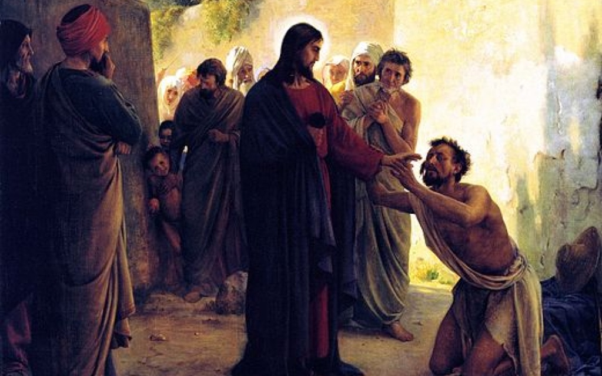

# What is the Role of Christ in Transhumanism?

## Objective(s)
- Appreciate the role of Jesus Christ in overcoming death and sin.
- Distinguish between Jesus the person and ‘Christ’ the title.
- Take seriously Jesus’ invitation to take on the role of Christ.
- Make connections between the role of Christ and the aims of transhumanism.

## Summary
Jesus' invitation to his followers to join him is compatible with transhumanist aims to overcome human shortcomings.

## Jesus Christ as Savior and Redeemer
Jesus Christ is the central figure in Christianity. He is revered not only for what he taught, but also for his role in saving humanity. Christians, including Mormons, believe that Jesus was more than just a moral teacher, he was the son of God, and savior and redeemer of humanity. He is the **savior `One who saves, delivers, or preserves; a title commonly given to Jesus.`** and **redeemer `One who pays the price for, or liberates; a title commonly given to Jesus.`** because he saves humanity from, and pays the price for **death `The end of life for an organism or organisms.`** and **sin `Missing the mark; often referring to a fault or moral failing.`** so that humanity can join God. To find ourselves in a position to one day join God is a gift of **grace `An unearned gift or favor.`**.

## The Title ‘Christ’
**_Christ_ `A title meaning ‘the anointed’, or one set apart for a special purpose.`** is a title that means ‘the **anointed `Literal: ritual smearing with oil used to signify one has a divine or holy calling.`**’, that is, someone set apart for a special purpose. We use "christ" to describe Jesus, not because his last name was "christ", but because we recognize Jesus as someone set apart with a special purpose, namely to overcome obstacles that stand between humanity and God. 

## The Invitation of Christ 
Jesus invited his followers to take on the name or role of Christ. We do this as we work together to overcome obstacles that stand between humanity and God. This may be as simple as befriending a neighbor, learning CPR, or saying “I’m sorry”. It may also include improving treatments for diseases, expanding our moral vision, or ethically extending technological or biological abilities. These are all central aims of transhumanism. 

## The Role of Christ in Transhumanism
As Christians and as transhumanists, we take Christ’s invitation seriously, and avoid artificial limits to our role in that work. Transhumanism is the ethical use of science and technology to expand human abilities. The role of Christ in transhumanism is to work toward the best, most ethical outcomes; in other words, to join God. This includes practical steps that work to care for the poor and needy, lift each other with grace, and overcome death and sin. This work did not end with Jesus, and will not end until all obstacles that stand between humanity and God are overcome.

## Discussion Questions: 
- How are the aims of transhumanism compatible (or not) with the aims of Christ?
- What are the benefits/dangers of assuming/neglecting responsibilities to take on the role of Christ?
- How do you interpret [John 14:12](https://www.lds.org/scriptures/nt/john/14.12#p12)? What does it mean to “do even greater things” than Jesus did?
- What does it mean to you to “take on the name of Christ”?
- Is it important to draw a line between Jesus’ role in overcoming death and sin and ours? If so, where do you draw the line?
- What are the benefits/dangers of bringing transhumanism and the work of Christ into conversation?

## Call to Action: 
- Participate in an activity that is compatible with the work of Christ and the aims of transhumanism.

## Resources for further study/engagement: 
- [Transhumanist advent](http://www.transfigurist.org/2016/12/a-transhumanist-advent.html)
- [Mormon Transhumanism](https://www.youtube.com/watch?v=AeyJbROo-Pw)
- [Come Follow Me: The Instrumental Atonement](https://www.youtube.com/watch?v=KPdE_1UVNBc)
- [Ye are the Body of Christ](http://www.blaireostler.com/journal/2016/12/20/ye-are-the-body-of-christ)
